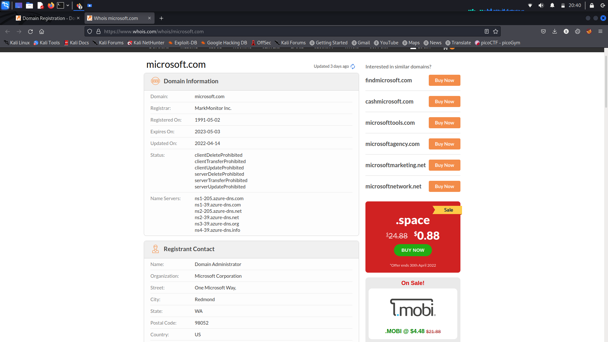
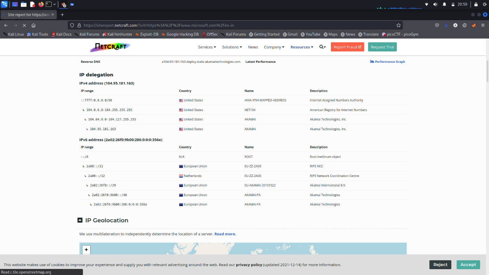
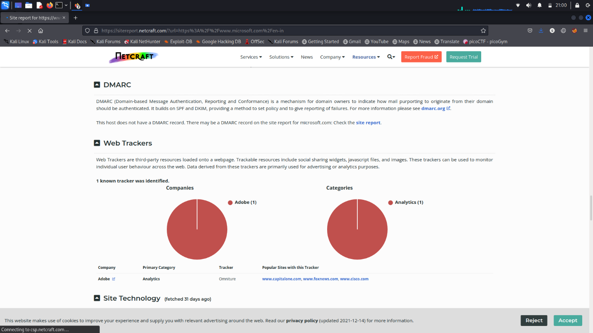
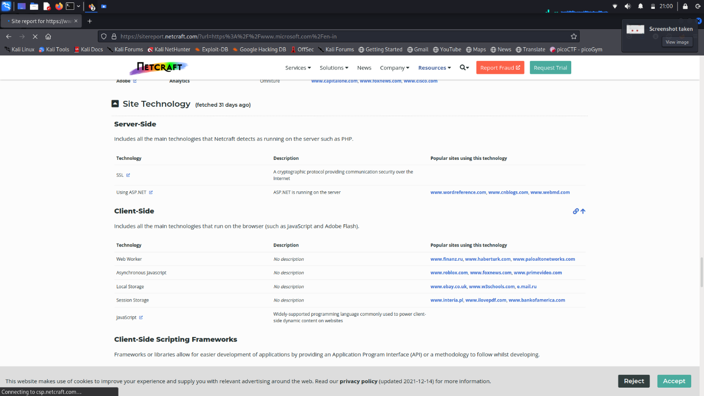
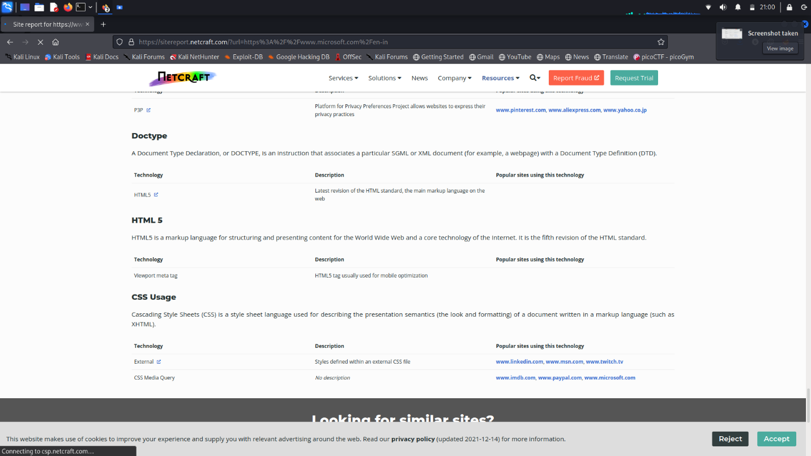
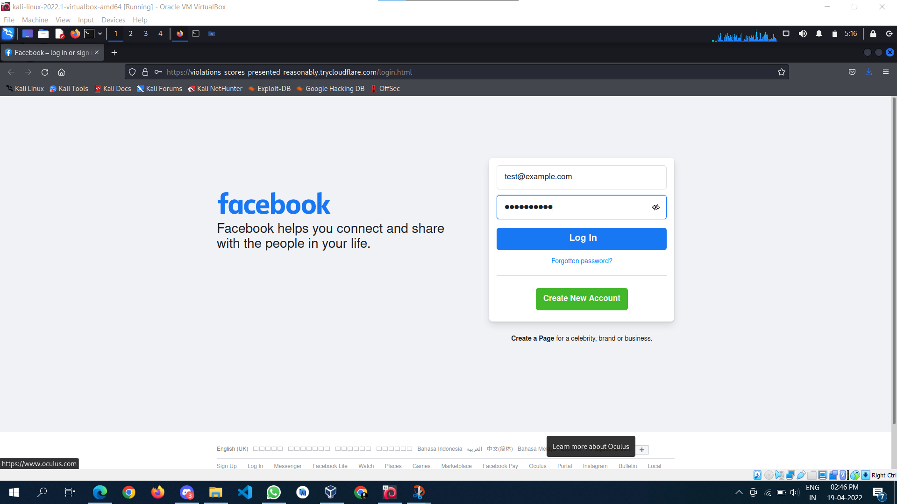

{width="6.5in" height="0.7083333333333334in"}

## **Foot printing on Microsoft website**

-   First go the
    "[[https://www.microsoft.com/en-in]{.underline}](https://www.microsoft.com/en-in)"
    and copy the domain address

## **WHOIS** -

{width="6.5in" height="3.6527777777777777in"}

Go to the WHOIS website and paste the microsoft domain address

Then we got the following information

{width="6.5in" height="3.6527777777777777in"}

{width="6.5in" height="3.6527777777777777in"}

And we also got the raw data

{width="6.5in" height="3.6527777777777777in"}

{width="6.5in" height="3.6527777777777777in"}

-   From the WHOIS scan we got to know about

-   Domain Information

    -   Domain

    -   Registrar

    -   Registered date

    -   Expire date

    -   Updated date

    -   Status

    -   Servers Names

-   Registrant Contact

    -   Name

    -   Organization

    -   Street

    -   City

    -   State

    -   Postal code

    -   Country

    -   Phone

    -   Fax

    -   Email

-   Administrative Contact information

    -   Name

    -   Organization

    -   Street

    -   City

    -   State

    -   Postal code

    -   Country

    -   Phone

    -   Fax

    -   Email

-   

-   

-   Technical Contact information

    -   Name

    -   Organization

    -   Street

    -   City

    -   State

    -   Postal code

    -   Country

    -   Phone

    -   Fax

    -   Email

## **NETCRAFT** -

{width="6.5in" height="3.65625in"}

Go to the NETCRAFT website and paste the microsoft domain address

Then we got the following information

{width="6.5in" height="3.65625in"}

{width="6.5in" height="3.65625in"}

{width="6.5in" height="3.65625in"}

{width="6.5in" height="3.65625in"}

{width="6.5in" height="3.65625in"}

{width="6.5in" height="3.65625in"}

{width="6.5in" height="3.65625in"}

{width="6.5in" height="3.65625in"}

{width="6.5in" height="3.65625in"}

{width="6.5in" height="3.65625in"}

{width="6.5in" height="3.65625in"}

{width="6.5in" height="3.65625in"}

By using NETCRAFT we got so much information from a single microsoft
domain scan

-   Background

    -   Site title

    -   Site rank

    -   Description

    -   Date first seen

    -   Netcraft Risk Rating

    -   Primary language

-   Network

    -   Site

    -   Netblock owner

    -   Hosting company

    -   Hosting country

    -   IPV4

    -   IPV6

    -   Reverse DNS

    -   Domain

    -   Name server

    -   Domain registrar

    -   Nameserver Organization

    -   Organization

    -   DNS admin

    -   Top level Domain

    -   DNS security extension

    -   Latest Performance

-   IP Delegation

-   IP Geolocation

-   SSL/TLS Information

-   Certificate Transparency

-   SSLv3/POODLE

-   SSL Certificate Chain

    -   Common Name

    -   Organization unit

    -   Organization

    -   Validity period

-   Hosting History

-   Sender Policy Framework

-   DMARC record

-   Web Trackers

-   Site Technology

    -   Server side

    -   Client side

    -   Client side Scripting Frameworks

    -   Content Delivery Network

    -   E Commerce

    -   Character Encoding

    -   HTTP Compression

    -   Web Browser Targeting

    -   Privacy Management

    -   Doctype

    -   HTML 5

    -   CSS Usage

> \*\*\*\*\*\*\*\*\*\*\*\*\*\*\*\*\*\*\*\*\*\*\*\*\*\*\*\*\*\*\*\*\*\*\*\*\*\*\*\*\*\*\*\*\*\*\*\*\*\*\*\*\*\*\*\*\*\*\*\*\*\*\*\*\*\*\*
>
> bayprofile01.microsoft.com:207.46.23.13
>
> bayvlsc01.microsoft.com:64.4.17.16
>
> bn1vlsctest01.microsoft.com:134.170.22.43
>
> by2profiletest01.microsoft.com:207.46.22.12
>
> cmsbn1test01.microsoft.com:134.170.22.53
>
> cmsbn1test10.microsoft.com:134.170.22.62
>
> cmsbn1test11.microsoft.com:134.170.22.63
>
> cmsby2test60.microsoft.com:134.170.188.97
>
> cmsco2test51.microsoft.com:134.170.184.36
>
> cmsco2test60.microsoft.com:134.170.184.45
>
> cmscy1test51.microsoft.com:23.103.192.29
>
> cmscy1test60.microsoft.com:23.103.192.54
>
> co1profile01.microsoft.com:65.55.57.121
>
> co1profile10.microsoft.com:65.55.57.124
>
> co1profile11.microsoft.com:157.56.60.55
>
> co1profiletest01.microsoft.com:65.55.21.48
>
> co1vlsc01.microsoft.com:65.55.57.88
>
> co2vlsctest51.microsoft.com:134.170.184.170
>
> duschy644macas001.microsoft.com:157.58.206.132
>
> eus.firstparty.entitlements.commerce.microsoft.com:20.75.108.198
>
> eus.frontdoor.entitlements-int.commerce.microsoft.com:20.84.29.48
>
> eus2s2-staging-dcatbackend.staging.bigcatalog.commerce.microsoft.com:20.85.64.201
>
> jmatfy20.microsoft.com:52.250.126.81
>
> jmatpipcfy20.microsoft.com:52.250.126.81
>
> kailani-ess.one.microsoft.com:40.123.47.110
>
> kspv501.microsoft.com:207.46.119.218
>
> lshefner.myworkspace.microsoft.com:52.176.71.88
>
> msonlineppe2010.microsoft.com:70.37.188.23
>
> my2010.microsoft.com:70.37.188.22
>
> neus2-staging-dcatbackend.staging.bigcatalog.commerce.microsoft.com:40.127.154.42
>
> neus2-stagingretrieval-dcatbackend.staging.bigcatalog.commerce.microsoft.com:40.127.154.42
>
> ocss30.microsoft.com:147.243.37.41
>
> onegdc90.microsoft.com:52.229.31.127
>
> paspsites2010.microsoft.com:70.37.188.22
>
> ppe2010my.microsoft.com:70.37.188.29
>
> ppemy2010.microsoft.com:70.37.188.29
>
> ppepaspsites2010.microsoft.com:70.37.188.29
>
> ppespsites2010.microsoft.com:70.37.188.29
>
> ppeteam2010.microsoft.com:70.37.188.29
>
> pss-imc-01.microsoft.com:131.107.3.100
>
> rap01.microsoft.com:131.107.0.4
>
> reddas01.microsoft.com:131.107.0.240
>
> saestp01.microsoft.com:147.243.6.16
>
> spf-a.microsoft.com
>
> spf-b.microsoft.com
>
> spf-c.microsoft.com
>
> spf-ssg-a.microsoft.com
>
> spf1-meo.microsoft.com
>
> spsites2010.microsoft.com:70.37.188.22
>
> spteam2010.microsoft.com:70.37.188.22
>
> tide001.microsoft.com:131.107.76.143
>
> tide010.microsoft.com:131.107.76.154
>
> tide110.microsoft.com:63.64.43.144
>
> tide111.microsoft.com:63.64.43.145
>
> tide120.microsoft.com:207.46.89.12
>
> tide121.microsoft.com:207.46.89.14
>
> tide130.microsoft.com:213.199.128.157
>
> tide151.microsoft.com:207.68.188.120
>
> tide160.microsoft.com:131.107.8.41
>
> tide20.microsoft.com:205.248.101.84
>
> tide21.microsoft.com:205.248.101.85
>
> tide40.microsoft.com:131.107.0.83
>
> tide41.microsoft.com:131.107.0.84
>
> tide50.microsoft.com:207.68.188.50
>
> tide500.microsoft.com:131.107.0.70
>
> tide501.microsoft.com:131.107.0.71
>
> tide510.microsoft.com:131.107.0.80
>
> tide511.microsoft.com:131.107.0.81
>
> tide513.microsoft.com:131.107.0.83
>
> tide514.microsoft.com:131.107.0.84
>
> tide520.microsoft.com:131.107.0.90
>
> tide530.microsoft.com:131.107.0.100
>
> tide531.microsoft.com:131.107.0.101
>
> tide540.microsoft.com:131.107.0.110
>
> tide541.microsoft.com:131.107.0.111
>
> tide550.microsoft.com:131.107.0.120
>
> tide551.microsoft.com:131.107.0.121
>
> tide611.microsoft.com:94.245.127.11
>
> tide620.microsoft.com:94.245.127.20
>
> tide70.microsoft.com:131.107.71.225
>
> tide80.microsoft.com:131.107.37.244
>
> toolbar-prod-bn01.microsoft.com:20.41.62.11
>
> wus2-staging-dcatbackend-int.staging.bigcatalog-int.commerce.microsoft.com:40.64.106.90
>
> wus2-stagingretrieval-dcatbackend-int.staging.bigcatalog-int.commerce.microsoft.com:40.64.106.90
>
> wus2s2-staging-dcatbackend-int.staging.bigcatalog-int.commerce.microsoft.com:40.64.106.90
>
> www.cy1test51.microsoft.com:23.103.192.31
>
> www.cy1test60.microsoft.com:23.103.192.38
>
> wwwbn1test51.microsoft.com:134.170.22.87
>
> wwwbn1test60.microsoft.com:134.170.22.95
>
> wwwby2test51.microsoft.com:134.170.188.12
>
> wwwby2test60.microsoft.com:134.170.188.21
>
> wwwby2test70.microsoft.com:134.170.188.31
>
> wwwby2test80.microsoft.com:134.170.188.41
>
> wwwco1test01.microsoft.com:65.55.21.9
>
> wwwco1test10.microsoft.com:65.55.21.18
>
> wwwco1test11.microsoft.com:65.55.21.19
>
> wwwco1test20.microsoft.com:65.55.48.229
>
> wwwco1test21.microsoft.com:65.55.48.230
>
> wwwco1test30.microsoft.com:65.55.48.239
>
> wwwco1test31.microsoft.com:65.55.48.240
>
> wwwco1test41.microsoft.com:157.56.62.31
>
> wwwco1test50.microsoft.com:157.56.62.50
>
> wwwco1test51.microsoft.com:157.56.62.51
>
> wwwco2test51.microsoft.com:134.170.185.19
>
> wwwco2test60.microsoft.com:134.170.185.10
>
> wwwco2test70.microsoft.com:134.170.184.255
>
> wwwco2test80.microsoft.com:134.170.184.245

Use Wireshark Tool(Download it from Internet) to sniff the data and try
to get the username and password of <http://demo.testfire.net/>

{width="6.5in" height="0.5305555555555556in"}

{width="7.046875546806649in"
height="3.9608562992125984in"}

{width="7.322916666666667in"
height="4.118358486439195in"}

 

 

{width="7.505208880139983in"
height="4.221679790026247in"}

{width="7.660715223097113in"
height="4.296874453193351in"}

{width="7.519946412948381in"
height="4.229166666666667in"}

{width="7.49216426071741in"
height="4.213542213473316in"}

{width="6.234375546806649in"
height="0.7864588801399826in"}

Try to Encrypt the Data in image file using quick stego tool (Download
from Internet) and command prompt also and show them how to decrypt
also. Write a report advantages of cryptography and steganography)

**Quick Stego Tool**\
{width="4.365037182852143in"
height="3.7572451881014874in"}

{width="5.455075459317586in"
height="4.2711406386701665in"}

**Encryption**

{width="6.87791447944007in"
height="5.589352580927384in"}

{width="6.268055555555556in"
height="3.529166666666667in"}

**Decryption**

{width="6.268055555555556in"
height="3.5256944444444445in"}

{width="6.268055555555556in"
height="5.535416666666666in"}

**Command Line**

**Encrypt**

{width="5.4537839020122485in"
height="4.558918416447944in"}

{width="5.646158136482939in"
height="4.228675634295713in"}

**Decrypt**

{width="6.268055555555556in"
height="4.821527777777778in"}

Advantages of Cryptography

> Cryptography is an essential information security tool. It provides
> the four most basic services of information security −

-   **Confidentiality** − Encryption technique can guard the information
    > and communication from unauthorized revelation and access of
    > information.

-   **Authentication** − The cryptographic techniques such as MAC and
    > digital signatures can protect information against spoofing and
    > forgeries.

-   **Data Integrity** − The cryptographic hash functions are playing
    > vital role in assuring the users about the data integrity.

-   **Non-repudiation** − The digital signature provides the
    > non-repudiation service to guard against the dispute that may
    > arise due to denial of passing message by the sender.

> All these fundamental services offered by cryptography has enabled the
> conduct of business over the networks using the computer systems in
> extremely efficient and effective manner.

Advantages of Steganography

-   The advantage of steganography, over cryptography alone, is that
    messages do not attract attention to themselves. Plainly visible
    encrypted messages---no matter how unbreakable---will arouse
    suspicion, and may in themselves be incriminating in countries where
    encryption is illegal. Therefore, whereas cryptography protects the
    contents of a message, steganography can be said to protect both
    messages and communicating parties.

-   This method featured security, capacity, and robustness, the three
    needed aspects of steganography that makes it useful in hidden
    exchange of information through text documents and establishing
    secret communication.

-   Important files carrying confidential information can be in the
    server in and encrypted form No intruder can get any useful
    information from the original file during transmit.

-   With the use of Steganography Corporation government and law
    enforcement agencies can communicate secretly.

Write a small batch program and save as .bat extension and execute in
victim machine (Windows 7 /Windows 10 / Windows XP)
{width="7.268055555555556in"
height="0.5020833333333333in"}

{width="5.821292650918635in"
height="4.953124453193351in"}

{width="5.734375546806649in"
height="3.9359601924759406in"}

{width="6.020833333333333in"
height="4.9212445319335085in"}

{width="5.859375546806649in"
height="4.831349518810149in"}

{width="5.861882108486439in"
height="4.651042213473316in"}

{width="5.7332502187226595in"
height="4.698531277340332in"}

Clone a Facebook page and try to perform Desktop Phishing in your local
machine and capture the credentials and write the document along with
screenshots and suggest the solution to avoid from phishing

{width="7.268055555555556in"
height="0.7048611111111112in"}

{width="7.393370516185477in"
height="4.158669072615923in"}

{width="7.4668503937007875in" height="4.2in"}

{width="7.732638888888889in" height="4.35in"}

{width="7.268055555555556in"
height="4.0881944444444445in"}

{width="7.268055555555556in"
height="4.0881944444444445in"}

{width="7.268055555555556in"
height="4.0881944444444445in"}

{width="7.268055555555556in"
height="4.0881944444444445in"}

## Prevent Phishing Attacks

Here are 10 simple tips to identifying and preventing phishing scams.

### 1. Know what a phishing scam looks like

New phishing attack methods are being developed all the time, but they
share commonalities that can be identified if you know what to look for.
There are many sites online that will keep you informed of the latest
phishing attacks and their key identifiers. The earlier you find out
about the latest attack methods and share them with your users through
regular security awareness training, the more likely you are to avoid a
potential attack.

### 2. Don't click on that link

It's generally not advisable to click on a link in an email or instant
message, even if you know the sender. The bare minimum you should be
doing is hovering over the link to see if the destination is the correct
one. Some phishing attacks are fairly sophisticated, and the destination
URL can look like a carbon copy of the genuine site, set up to record
keystrokes or steal login/credit card information. If it's possible for
you to go straight to the site through your search engine, rather than
click on the link, then you should do so.

### 3. Get free anti-phishing add-ons

Most browsers nowadays will enable you to download add-ons that spot the
signs of a malicious website or alert you about known phishing sites.
They are usually completely free so there's no reason not to have this
installed on every device in your organization.

### 4. Don't give your information to an unsecured site

If the URL of the website doesn't start with "https", or you cannot see
a closed padlock icon next to the URL, do not enter any sensitive
information or download files from that site. Site's without security
certificates may not be intended for phishing scams, but it's better to
be safe than sorry.

### 5. Rotate passwords regularly

If you've got online accounts, you should get into the habit of
regularly rotating your passwords so that you prevent an attacker from
gaining unlimited access. Your accounts may have been compromised
without you knowing, so adding that extra layer of protection through
password rotation can prevent ongoing attacks and lock out potential
attackers.

### 6. Don't ignore those updates

Receiving numerous update messages can be frustrating, and it can be
tempting to put them off or ignore them altogether. Don't do this.
Security patches and updates are released for a reason, most commonly to
keep up to date with modern cyber-attack methods by patching holes in
security. If you don't update your browser, you could be at risk of
phishing attacks through known vulnerabilities that could have been
easily avoided.

### 7. Install firewalls

Firewalls are an effective way to prevent external attacks, acting as a
shield between your computer and an attacker. Both desktop firewalls and
network firewalls, when used together, can bolster your security and
reduce the chances of a hacker infiltrating your environment.

### 8. Don't be tempted by those pop-ups

Pop-ups aren't just irritating; they are often linked to malware as part
of attempted phishing attacks. Most browsers now allow you to download
and install free ad-blocker software that will automatically block most
of the malicious pop-ups. If one does manage to evade the ad-blocker
though, don't be tempted to click! Occasionally pop-ups will try and
deceive you with where the "Close" button is, so always try and look for
an "x" in one of the corners.

### 9. Don't give out important information unless you must

As a general rule of thumb, unless you 100% trust the site you are on,
you should not willingly give out your card information. Make sure, if
you have to provide your information, that you verify the website is
genuine, that the company is real and that the site itself is secure.

### 10. Have a Data Security Platform to spot signs of an attack

If you are unfortunate enough to be the victim of a successful phishing
attack, then it's important you are able to detect and react in a timely
manner. Having a [data security
platform](https://www.lepide.com/data-security-platform/) in place helps
take some of the pressure off the IT/Security team by automatically
alerting on anomalous user behavior and unwanted changes to files. If an
attacker has access to your sensitive information, data security
platforms can help to identify the affected account so that you can take
actions to prevent further damage.
